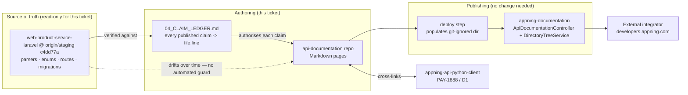
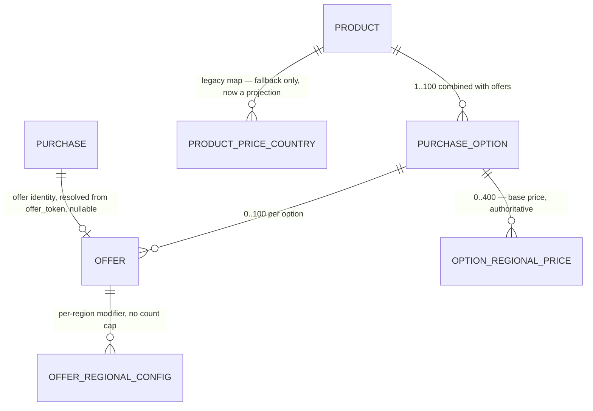
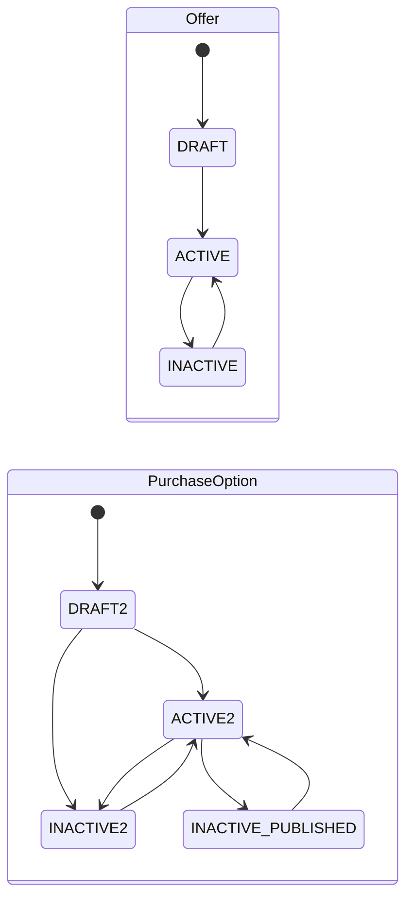

# Architecture: update-onetimeproducts-docs

**Issue:** PAY-1889 · **Phase:** 3 (Design) · **Date:** 2026-09-03

> **How to read this document.** The deliverable is a set of Markdown pages, not running code. The eight required sections are therefore mapped onto their real analogues in this repository, and where a section has no analogue that is stated plainly instead of being filled with invented code architecture. Sections 3 (Data Model), 4 (API Design), 5 (State Management) and 6 (Error Handling) describe **the contract being documented** — that is the substance an integrator needs, and getting it right is the whole ticket. Sections 7 and 8 describe the pages and the publishing path, where the only real performance and scale questions live.

---

## 1. System Context



Three facts about this context drive every decision below.

1. **The code is upstream and unowned by this ticket.** We read `origin/staging`; we change nothing there. The documentation is a *projection* of that code, and projections go stale — the dotted edge is the failure mode this ticket is repairing, and nothing in the pipeline prevents it recurring.
2. **The portal needs no change.** It reads this repository's Markdown at request time from a git-ignored directory populated at deploy (`ApiDocumentationController::show()`). Adding files and directories is sufficient to publish them; the file tree becomes both the navigation tree and the URL tree.
3. **The reader is external.** Everything published is partner-facing. This is why internal identifiers stay out of the pages (§ADR-005) and why endpoint availability must be stated honestly (§ADR-003).

---

## 2. Component Design

"Components" here are page types and the reusable blocks inside them. Existing components keep their current shape; new ones follow it.

| Component | Status | Responsibility |
|---|---|---|
| **Surface preamble** | **New**, shared block | States path shape, auth model, error envelope and pagination for the surface a page belongs to. Appears once per page, immediately after the `Adapted from:` line. Mitigates the surface-conflation risk (02 §5.4) |
| **Availability marker** | **New**, inline badge | One line per endpoint page stating whether the endpoint is generally available or gated. Resolves the feature-flag blocker without guessing deploy state (ADR-003) |
| **Provenance marker** | **New**, per field and per cap | Marks each item as Google's, Appning's, or accepted-but-inert. Carries the ticket's "stored but not enforced" criterion and prevents mis-attributing our caps to Google (ADR-002) |
| **Enforcement table** | **New**, per method page | Cap · value · what it applies to · whose rule it is · when enforced (write time / purchase time / not enforced) |
| **Method page** | Existing pattern | One page per endpoint: HTTP request, path/query parameters, request body, response body, status codes and errors, auth, local references |
| **Resource page** | Existing pattern | Resource JSON + field list + nested types + inline enums + resource-methods list |
| **Type page** | Existing pattern | One schema or enum per page under `types/` |
| **Section index** | Existing, extended | `README.md` structure list + covered sub-links; must list every new page |
| **Root endpoint table** | Existing, extended | `README.md` at repo root — the endpoint index an integrator lands on |
| **Claim ledger** | **New**, internal only | `04_CLAIM_LEDGER.md` in the planning directory. Maps every published claim to `file:line`. Not published (ADR-005) |

### Page tree (additive — no existing file moves; see ADR-001 and §Rollback)

```
docs/appning/android-publisher/monetization.onetimeproducts/
  README.md                              MODIFY  index + sub-links
  batchUpdate.md                         MODIFY  caps, unknown-key rejection, updateMask lists, offers[]
  monetization.onetimeproducts.md        MODIFY  offers[], pricing union, provenance + enforcement markers
  offers/                                NEW
    README.md                            NEW     offer surface index
    offers.md                            NEW     Offer resource + OfferState + transitions
    list.md  batchGet.md                 NEW     reads
    activate.md  deactivate.md           NEW     single-offer lifecycle
    batchUpdateStates.md  batchDelete.md NEW     batch lifecycle
  purchase-options/                      NEW
    README.md                            NEW
    batchUpdateStates.md                 NEW     both variants, one page
    batchDelete.md                       NEW
  types/                                 NEW pages, existing pattern
    offer-state.md  purchase-option-state.md
    offer-availability.md  offer-pricing-variant.md
    relative-discount.md  absolute-discount.md
    resolved-price.md  offer-token.md
```

Filenames are chosen for the navigation label they produce, because `DirectoryTreeService` renders filenames verbatim.

---

## 3. Data Model

**This repository has no schema.** No migration, no entity, no store. What follows is the *documented* model — the object graph a reader must understand, and the storage facts that leak into the contract as observable behaviour.



Contract-visible consequences, each of which must appear on a page:

- **Base price is owned by the purchase option**, not the product. An option with its own regional price rows uses them **exclusively**; an option with none falls back to the product-level legacy map. There is no per-region merge — a partially-covered option does not inherit the product price for its uncovered regions.
- **An offer never carries a price**, only a per-region modifier: exactly one of `noOverride`, `relativeDiscount`, `absoluteDiscount`.
- **An offer region must already be priced on its parent option.**
- **Writes replace, they do not merge.** Offers absent from a payload are deleted; a region set is written delete-then-insert. This is the single most surprising behaviour in the contract and needs stating on both the method page and the resource page.
- **The option-level regional config set is not serialised on any read.** A reader sees an option's base price only indirectly, as `base_price` inside each offer region entry. It *is* echoed in the `:batchUpdate` response.
- **Offer identity on a purchase is two nullable public string ids, not foreign keys**, because a fallback purchase has no rows to point at.

Cardinality caps and their provenance (the enforcement table's content):

| Cap | Value | Whose rule | Enforced |
|---|---|---|---|
| batch items | 100 | Google | request boundary, both surfaces |
| purchase options per product | 100 | **Appning** | write time |
| offers per option | 100 | **Appning** | write time |
| regional configs per option | 400 | **Appning** | write time |
| options + offers combined | 100 | Google | write time, **non-regression**: over-limit writes pass if they do not increase the count |
| offer tags, per level | 20 after de-duplication | Google | write time |
| tag content length | 20 chars | Google | write time |
| id length (`offerId`, `purchaseOptionId`) | 63 chars | Google | write time |
| title / description | 55 / 200 | Google | write time |
| `redemptionLimit` | 0, or 1–50 | Google | range at write time; **count at purchase time** |
| regional configs per **offer** | *(none)* | — | asymmetry with the option-level 400 — document as a known gap |

---

## 4. API Design (the surface being documented)

Two surfaces. Every page belongs to exactly one and says so in its preamble.

| | Partner / v3 | Seller / Console |
|---|---|---|
| Path | `/androidpublisher/v3/applications/{packageName}/…` | `/sellers/{uid}/inapp/oneTimeProducts/…` |
| Version prefix | `/api/8.YYYYMMDD/` optional — stripped before routing; `8.` + exactly 8 digits | same |
| Auth | Bearer JWT, RS256, `iss`=`sub`=`clientId`, `exp − iat ≤ 900` | same JWT, plus seller scoping: the `{uid}` in the path must match the token's seller, else a uniform 403 |
| Error envelope | `{"error":{code,message,errors[],status}}` | `{code,path,text,data}` |
| Pagination | — | numbered pages with exact total (catalogue); `pageToken` + `nextPageToken` (offers) |
| Batch semantics | Google-style | **all-or-nothing** — one bad item rolls back the batch |

### Endpoints to document

| Page | Method | Path tail | Success | Notable errors |
|---|---|---|---|---|
| `batchUpdate.md` *(exists)* | POST | `oneTimeProducts:batchUpdate` | 200 `{oneTimeProducts[], warnings[]?}` | 400 missing / 400 invalid |
| `offers/list.md` | GET | `…/purchaseOptions/{poId}/offers` | 200 `{oneTimeProductOffers[], nextPageToken}` | 400 wildcard misuse |
| `offers/batchGet.md` | POST | `…/offers:batchGet` | 200 `{oneTimeProductOffers[]}` | 400 duplicate target; unresolvable offers **absent, not 404** |
| `offers/activate.md` | POST | `…/offers/{offerId}:activate` | **204** empty | 404 unresolvable; 409 invalid transition |
| `offers/deactivate.md` | POST | `…/offers/{offerId}:deactivate` | 204 | same |
| `offers/batchUpdateStates.md` | POST | `…/offers:batchUpdateStates` | 204 | 400 unusable state; 404; 409 |
| `offers/batchDelete.md` | POST | `…/offers:batchDelete` | 204 | 409 last offer of an ACTIVE option |
| `purchase-options/batchUpdateStates.md` | POST | `…/purchaseOptions:batchUpdateStates` *(per-product and cross-product)* | 204 | 400; 404; 409 invalid transition; 409 ambiguous legacy option |
| `purchase-options/batchDelete.md` | POST | `…/{productId}/purchaseOptions:batchDelete` | 204 | 409 not deletable unless DRAFT; unknown ids skipped, call still succeeds |

Two path conventions that must be documented rather than tidied: `-` acts as a wildcard for `{productId}` and `{purchaseOptionId}` on offer reads (but a specific option under a wildcard product is a 400), and request-body ids are ignored where the path already carries them on the per-product variant while being **required** on the cross-product variant.

`:cancel` is deliberately absent and belongs in the not-implemented list with its reason (Google's `cancel` targets a pre-order-only state; pre-orders are rejected on write).

### `offer_token`

Not an endpoint — a field with an integration contract: `otk_` + 32 base64url chars, 36 total, one-way, no expiry, re-derived on every read. Appears on the buyer catalogue and Console product detail; **absent** from the Console offers list and `batchGet`. Accepted inbound as a top-level field on purchase-create. Its page states the resolution contract and the client rules that matter (read `price.value` not `price.micros`; parse as a decimal without assuming two places; do not cache across requests; fail closed; there is no token-lookup endpoint).

---

## 5. State Management

Two state machines to document, plus one authoring state.



Rules that belong on the page, not just the diagram:

- **Nothing transitions into `DRAFT`.** It is an initial state only.
- **Same-state is legal and writes nothing** — retries are idempotent.
- `STATE_UNSPECIFIED` is accepted at the boundary and then rejected, so it can never be stored. `CANCELLED` is not modelled at all.
- `state` is **output-only on writes** — but rejection is Console-only; the v3 surface still accepts and silently ignores it. That asymmetry is deliberate (not breaking live Google-compatible clients) and must be documented per surface rather than as one rule.
- **Sellability is two gates, not one**: state must be `ACTIVE` **and** the offer must be inside its schedule window — `start_time` inclusive, `end_time` exclusive. Both are applied on the buyer read only. Console reads are deliberately ungated so an operator can see and fix a draft or expired offer.
- **Deletability**: a purchase option is deletable only in `DRAFT` — stricter than Google, and must not be presented as parity.

**Authoring state** (internal): each claim in the ledger is `verified` (code cited), `pending`, or `rejected` (ticket said it, code disagrees). No page ships with a `pending` claim.

---

## 6. Error Handling Strategy

The strategy has two halves: what we document, and what we do when sources disagree.

### What we document

Per surface, because the shapes differ:

```
v3:       {"error": {"code": 400, "message": "...", "errors": [{message, domain, reason, location?}], "status": "INVALID_ARGUMENT"}}
Console:  {"code": "...", "path": "...", "text": "...", "data": null}
```

- **Two validation buckets, and `missing` wins.** If any required field is absent, the invalid-value list is discarded entirely — so a caller fixing errors may see a *different* set on the next attempt. This is non-obvious and must be stated.
- **Validation does not stop at the first error**: the whole item is walked so one 400 reports everything it can.
- **Unknown keys are rejected** at 20 nesting levels, reporting at most 10 per object plus a "more not listed" line. Message shape deliberately mirrors Google's wording so an integrator searching Google's error string finds ours.
- **Status codes to document per endpoint**: 200, 204, 400, 403 (seller scoping; also the redemption cap at purchase time), 404, 409 (four distinct conflict reasons, each with its own code string).
- **Error-catalogue block per method page**: code · HTTP status · when it happens · what to change. Preferred over prose because these are lookup targets.

### When sources disagree

The rule, and the reason it is a design decision rather than a working practice: **cite the parser, enum, route or migration — never an ADR, docblock or OpenAPI schema.** Research found nine in-repo prose claims contradicting their own code, including three ADRs in a correcting chain and both OpenAPI specs carrying correct prose beside a stale schema. Two research agents reached opposite conclusions on one question purely from which source they read.

Consequently: a claim without a code citation in the ledger does not get published. A ticket assertion that the code contradicts is recorded as `rejected` with evidence and raised on the ticket rather than written down.

---

## 7. Performance Considerations

Genuine, if modest, and all on the publishing path:

- **Portal render cost is per request.** `ApiDocumentationController` reads the file and renders Markdown on every hit, and `DirectoryTreeService::buildTree()` walks the **whole** tree to build navigation for *every* page view. Cost therefore scales with total file count, not page size. This is the one real reason to keep page count proportionate: ~18 new files against 13 existing roughly doubles that walk. Still trivial in absolute terms, but it argues against a page-per-field explosion.
- **Page weight**: target under ~40 KB per page so it stays usable on a slow connection; split by method rather than growing one page without bound.
- **Navigation depth**: the tree renders raw filenames, so deep nesting reads poorly. Two levels below the method group (`offers/`, `types/`) is the practical limit.
- **No client-side assets, no build step, no images** — nothing to optimise, and nothing to break.

Performance facts to *document* (about the API, not the docs): the offer list's `pageSize` defaults to 50 and is **coerced** to a 1–1000 range rather than rejected; the catalogue read is rate-limited per issuer; and the token-resolution contract requires one fresh read per transaction with **no caching**, because freshness is the expiry mechanism. No latency figure will be published — research confirmed none has been measured.

---

## 8. Scalability Notes

| Growth | Effect | Response |
|---|---|---|
| **10× pages** (~150) | Navigation becomes unreadable before rendering becomes slow; the flat filename tree is the bottleneck | Group by surface, as designed. Add per-directory `README.md` index pages, which the design already does |
| **100× pages** | Full-tree walk per request starts to matter; hand-maintained index lists drift from the file tree | At that point generate the indexes rather than hand-maintaining them, and cache the tree in the portal. Out of scope here; recorded so the trigger is known |
| **A second API version** (`8.YYYYMMDD` changes) | Pages assume one version segment | The version is a documented placeholder, not baked into examples beyond one canonical URL — cheap to change |
| **A third surface** | The two-surface preamble pattern generalises | Directory-per-surface already accommodates it |
| **The code keeps moving** | **The real scale problem.** Six months produced 353 commits and made two ticket claims stale before the ticket was worked | Nothing in this repository can detect drift. The ledger makes re-verification *cheap* (each claim carries its citation) but not automatic. A drift guard belongs in the source repo, where the console OpenAPI spec already has one; recommending it is a follow-up, not this ticket |

**Load on the documented system is unaffected by this ticket.** No endpoint, query or payload changes. The one indirect effect worth noting: documenting the Console surface may increase traffic to endpoints that are currently flag-gated, which is an argument for the availability marker (ADR-003), not against documenting them.

---

## Artifacts produced in this phase

- `03_ARCHITECTURE.md` (this file)
- `03_ADR-001-page-structure-by-surface.md`
- `03_ADR-002-provenance-and-enforcement-markers.md`
- `03_ADR-003-availability-status-over-omit-or-publish.md`
- `03_ADR-004-scope-not-implemented-list-per-surface.md`
- `03_ADR-005-no-internal-identifiers-in-published-pages.md`
- `03_ADR-006-document-offer-token-as-defined-contract.md`
- `03_PROJECT_SPEC.md`
